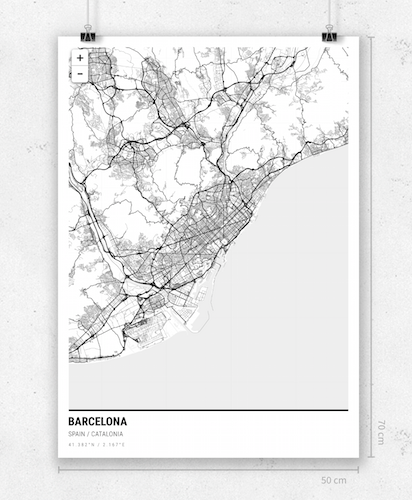

# Alvar Carto CartoCSS styles



These are the CartoCSS map stylesheets for Alvar Carto. They are used to render maps, which you can see at https://design.alvarcarto.com.

Services which are using these styles:

* https://github.com/kimmobrunfeldt/alvarcarto-tile-service
* https://github.com/kimmobrunfeldt/alvarcarto-render-service

The scale of these styles is designed so that rendering to 256x256 pixels with
scale 1 provides correct result. When rendering the final posters, where canvas size
is thousands of pixels, we're applying a scale multiplier to mapnik rendering.

*Forked from: https://github.com/gravitystorm/openstreetmap-carto*

## Usage

To compile CartoCSS projects to mapnik XML styles, run:

```bash
npm install
npm run build
```

## Local development

First fetch data files for mapnik styles:

```bash
./tools/install.sh
```

Then run:

```bash
npm run watch
```

## CI setup

On each push to master, these mapnik styles are deployed to `alvar-map-qa` server.

